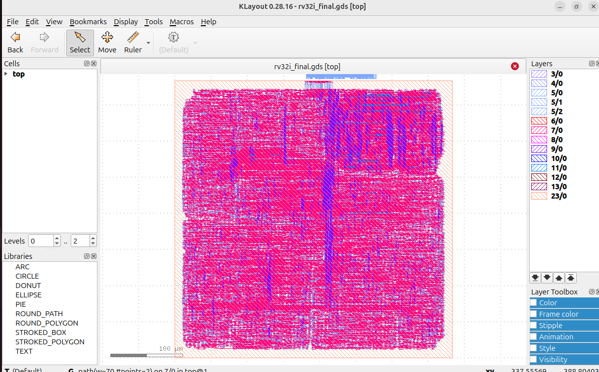

# 32-bit RISC-V RV32I RTL-to-GDSII Design Flow

## Project Overview

This project implements a 32-bit RISC-V RV32I processor from RTL design through physical implementation and final GDSII generation.

The complete flow covers:

RTL Design → Simulation → Synthesis → Floorplanning → Placement → CTS → Global Routing → Detailed Routing → GDSII

## Technology

- Technology: Nangate45
- Target clock: 50 MHz
- Clock period: 20 ns
- Physical design tools: OpenROAD
- Timing analysis: OpenSTA
- Layout verification/visualization: KLayout

## RTL Modules

- Program Counter
- Instruction Memory
- Instruction Decoder
- Register File
- Immediate Generator
- ALU
- ALU Control
- Control Unit
- Branch Unit
- Data Memory
- RV32I CPU
- Top-level module

## Physical Design Results

| Metric | Result |
|---|---:|
| Design area | 82,458 µm² |
| Core area | 131,148.11 µm² |
| Utilization | 62.9% |
| Total wire length | 535,410 µm |
| Total vias | 258,892 |
| Detailed-route violations | 0 |
| Final GDS size | 32 MB |

## Timing Results

| Metric | Result |
|---|---:|
| Clock frequency | 50 MHz |
| Clock period | 20 ns |
| Worst setup slack | -26.78 ns |
| Worst hold slack | +0.01 ns |
| CTS setup skew | 0.68 ns |

The final timing analysis shows a setup timing violation at 50 MHz. The critical-path analysis identifies the ALU/datapath logic as the dominant contributor to the delay.

Hold timing is satisfied.

## Final Layout

## Final GDSII

The final routed layout was exported to:

`physical/rv32i_final.gds`

The GDSII file was successfully opened and visually inspected in KLayout.

## Routing

Detailed routing converged to zero TritonRoute violations.

Final routing statistics:

- Wire length: 535,410 µm
- Vias: 258,892
- Routing violations: 0

## Conclusion

The project demonstrates a complete RTL-to-GDSII implementation flow for a 32-bit RV32I processor using the Nangate45 technology library.

The design successfully progresses through physical implementation and GDSII generation. The primary remaining optimization target is setup timing closure, particularly the ALU/datapath critical path.
